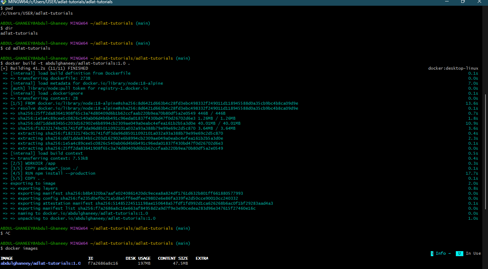
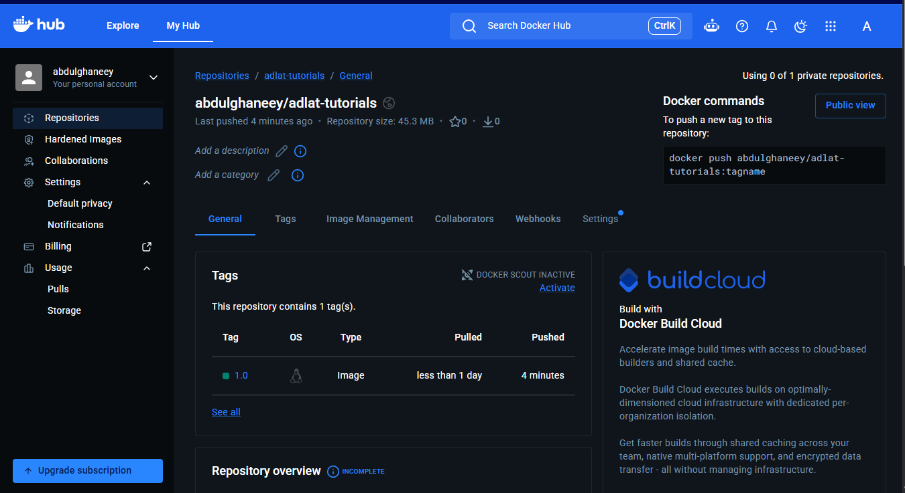
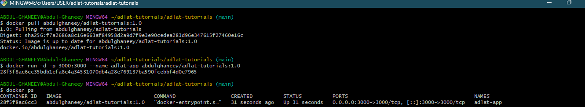
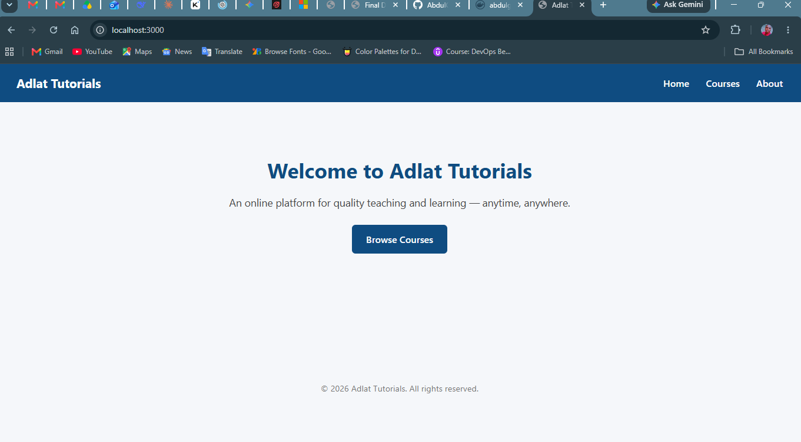

# Adlat Tutorials

Adlat Tutorials is a simple Node.js (Express) web application for an online
teaching platform. It was built and deployed as part of a Node.js & Docker
deployment assignment covering GitHub, Linux, Docker, and Docker Hub.

## Features
- Home, Courses, and About pages
- Sample course listings (Digital Literacy, Coding, Mathematics, MS Office)
- JSON API endpoint at `/api/courses`
- Health check endpoint at `/health`

## Tech Stack
- Node.js
- Express.js
- Docker

## Running Locally (without Docker)
```bash
npm install
npm start
```
Visit `http://localhost:3000`

## Running with Docker

Build the image:
```bash
docker build -t <your-dockerhub-username>/adlat-tutorials:1.0 .
```

Run the container:
```bash
docker run -d -p 3000:3000 <your-dockerhub-username>/adlat-tutorials:1.0
```

Visit `http://localhost:3000` (or `http://<server-ip>:3000` on a remote server)

## Pulling from Docker Hub
```bash
docker pull <your-dockerhub-username>/adlat-tutorials:1.0
```

## Deployment Steps (Assignment Checklist)
1. Generated the Node.js application (this repo)
2. Pushed the code to GitHub
3. Cloned the repository onto a Linux server
4. Created a Dockerfile
5. Built the Docker image
6. Pushed the image to Docker Hub
7. Pulled the image from Docker Hub
8. Ran the container and verified it was live

## Screenshots

### 1. Docker Build Command


### 2. Docker Hub Image


### 3. Running Docker Container


### 4. Live Application


## Author
Abdul-Ghaniy
